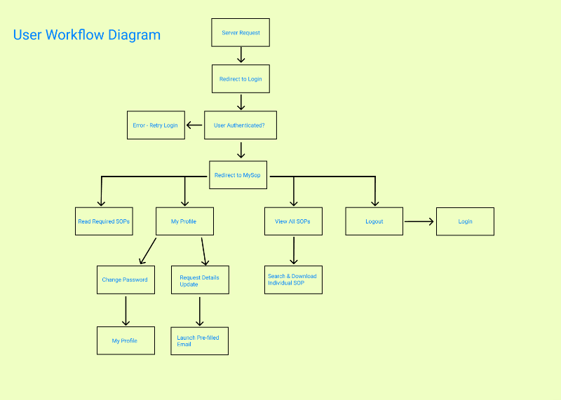
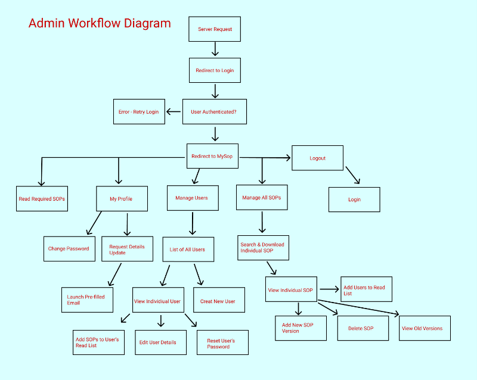
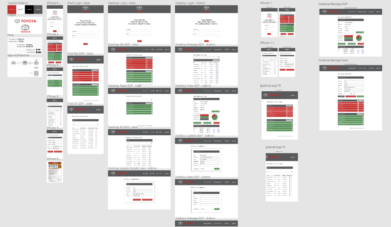
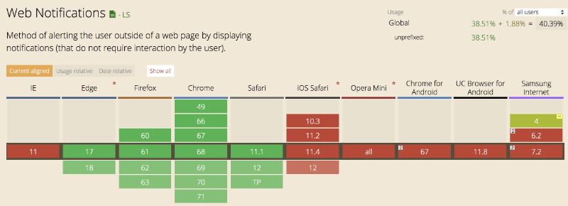

# CA Team 2 - Term 3 Group Project
# Safe Operating Procedure Management Application

Deployed: [https://zealous-morse-4b2e8d.netlify.com/](https://zealous-morse-4b2e8d.netlify.com/)

## Table of Contents

---

- **[Project Summary](#project-summary)**
  - [Project Specifications](#project-specifications)  
- **[Application Design](application-design)**
  - [Database Design](#database-design)
  - [User Stories](#user-stories)
  - [User Workflow](#user-workflow)
  - [Wireframes](#wireframes)
- **[Post Project Summary](post-project-summary)**
  - [Challenges](#challenges)
  - [Improvements](#improvements)
  - [Final Review](#final-review)

# Project Summary
Our client's Product Planning & Design Division incorporates several planning, design, development and testing departments all working towards building a better product for their Australian customers.

PPD division's OH&S department have a Safe Operating Procedure (SOP) system in place as part of the company's commitment to providing a safe workplace environment. The Safe Operating Procedures are generally a one to two page document provided to outline the safe procedure for a particular work process. Most employees are required to read and acknowledge that they have read any SOP's for tasks that relate to their job role. This is then recorded by the division OH&S department. 

The challenge is that in the current SOP tracking system is kept using excel spreadsheets and physical paper storage which both managers and employees find to be an inefficient and cumbersome. 

Our solution to this issue is to transfer the current inefficient system to a more automated and streamlined process through on online application. The application will allow employees to log in and view all Safe Operating Procedures they are required to read as well as providing access to all SOP's. Any SOP's read by an employee can be marked and recorded as being read. If a new version of an SOP is uploaded the latest version will be flagged in the employees My SOP page and be made available to read. 

The app will also have an adminstration login which will allow management and the OH&S committee to manage, create and update both users and SOP's.

Using our SOP management application administrators logged in will have access to:

- add, edit and delete users and SOP's
- allocate SOP's to users
- view all SOP's and statistics on viewings
- view individual employee profiles and their viewed SOP's

Staff will be able to login and track

- Which SOP's they are required to read
- Any new versions available of SOP's they have already read
- Which SOP's they have already read
- Employees will have access to all SOP's, including ones they are not required to read, but can do so if they choose to
- Our project will replace the current SOP manual tracking system which will greatly improve efficiency and remove the likelihood of user error.

## Project Specifications
The following tech stack was used to create this web application:\
__Front-end__
- JavaScript
- React
- Bootstrap
- CSS

__Back-end__
- Node.js
- Express
- MongoDB
- Mongoose

# Application Design
## Database Design
Our database schema design.\

## User Stories
Our User Stories
__OH&S Coordinator__
- [ SOP - Upload ] As the OH&S Coordinator I would like to add SOP's to a central database so that staff can have immediate access to new SOP's.
- [ SOP - Update ] [ SOP - Version Control ] As the OH&S Coordinator I would like to easily add updated SOP's to the database so that updates are made available to staff as soon as they are implemented.
- [ Users - Add New Users ] As the OH&S Coordinator I would like to add new users to the database so that there are no delays in adding new staff or staff changes to the SOP system.
- [ User - Update Existing User ] As the OH&S Coordinator I would like to be able to edit user accounts so that any staff changes are implemented as soon as they occur.
- [ User - Deactivate Existing User ] As the OH&S Coordinator I would like to be able to delete user accounts so that staff changes are implemented as soon as they occur.
- [ SOP - Version Control ] As the OH&S Coordinator I would like to keep copies of older versions of SOP's available on the database so that there is a traceable history of changes and progress for workplace safety audits.
- [ SOP - View All ] As the OH&S Coordinator I would like to access all SOP's so that I can view which ones have and have not been read.
- [ User - View individual Users Incomplete SOP ] [ User - View individual Users complete SOP ] As the OH&S Coordinator I would like to view all user profiles so that I can view which SOP's the user has or has not read.

__Department / Group Manager__
- [ User - View Staff Profile ] As a manager I would like to view my staff profiles so that I can confirm they have read their required SOP's and take action if required.
- [ SOP - Allocate users required to read SOP ] As a manager I would like to choose which SOP's my staff are required to read as each position may have individual requirements.
- [ SOP - Send notifications to employees yet to complete SOP ] As a manager I would like to be able to prompt my staff via the app if they have not met there SOP read requirements so that they can be reminded to do so. - (nice to have)
- [ SOP - Send notifications to employees if an SOP is updated ] As a manager I would like to be able to notify my staff via the app if they have not read an updated SOP so that they are up to date with the latest safety information. - (nice to have)
- [ SOP - View All ] [ SOP - Search All ] As a manager I would like to access the SOP and user database in an easy to use straight forward interface so that I don't have to learn how to use another system.

__Staff Member - Engineer__
- [ SOP - View All ] As an engineer I would like to have access to all the SOP's including those that my position requires of me so that I can do my job safely.
- [ Mobile Responsive Site ] As an engineer I would like to be able to have access to SOP's when I am working away from my desk, in the workshop or remotely so that I can have the appropriate safety information with me at all times.
- [ SOP - Versioning + Notification on Version Update ] As an engineer I would like to be notified if there has been a change to an SOP that I am required to be familiar with so that I am up to date with the latest information. - (nice to have)
- [ SOP - Search all ] As a engineer I would like to access the SOP and user database in an easy to use straight forward interface so that I don't have to learn how to use another system.
- [ SOP - View Unread ] As an engineer I would like to know which SOP's I have or have not read so I can keep track of my safety requirements.

__Staff Member - Technician__
- [ SOP - View All ] As an technician I would like to have access to all the SOP's that my position requires of me so that I can do my job safely.
- [ Mobile Responsive Site ] As an technician I would like to be able to have access to SOP's when I am working away from my desk, in the workshop or remotely so that I can have the appropriate safety information with me at all times.
- [ SOP - Versioning + Notification on Version Update ] As an technician I would like to know which SOP's I have or have not read so I can keep track of my safety requirements.
- [ SOP - Search all ] As an technician I would like to be notified if there has been a change to an SOP that I am required to be familiar with so that I am up to date with the latest information. - (nice to have)
- [ SOP - View Unread ] As a technician I would like to access the SOP and user database in an easy to use straight forward interface so that I don't have to learn how to use another system.

__Staff Member - Administration__
- [ SOP - View All ] As an administrator I would like to have access to all the SOP's that my position requires of me so that I can do my job safely.
- [ Mobile Responsive Site ] As an administrator I would like to be able to have access to SOP's when I am working away from my desk, in another part of the office so that I can have the appropriate safety information with me at all times.
- [ SOP - Versioning + Notification on Version Update ] As an administrator I would like to know which SOP's I have or have not read so I can keep track of my safety requirements.
- [ SOP - Search all ] As an administrator I would like to be notified if there has been a change to an SOP that I am required to be familiar with so that I am up to date with the latest information. - (nice to have)
- [ SOP - View Unread ] As a administrator I would like to access the SOP and user database in an easy to use straight forward interface so that I don't have to learn how to use another system.

Our User Stories Trello Board.\
\
Our Trello user stories board can be viewed here, [User Stories Trello Board](https://trello.com/b/PXeF8pny/user-stories).

## User Workflow
Our application is unique in the fact that employees (non-admin users) have much less functionality available to them than admins (managers). A regular user just needs the application to read the SOPs allocated to them by their manager, and agree to having read them.

The admins on the other hand, have the power to create new users, edit current users, create and edit new SOPs and SOP versions, add users to SOPs, manage user's forgotten passwords, manage user's employment status within the company and more.

This discrepancy of usability can be seen most clearly from the below user workflow diagrams;

Admin User (Employee)\

Admin User (Manager)\

## Wireframes
We built a significant amount of wireframes on Figma prior to commencing any code. We found this was a very good way of knowing what we were building along the way, both for the front-end and back-end. 

Although there were too many wireframes built to show them all in detail, some examples can be seen below:

Desktop - Admin (MySOP Page)\

Desktop - User (MySOP Page)\

Mobile - Admin (Users Pages)\

Mobile - User (Login Pages)\

The extent of out wireframes\

## Challenges
During the production period of our application, we inevitably faced several challenges that put a halt to plans.

The first and perhaps most serious challenge for us, was that due to our clients current IT situation, our app had to be fully compatible with Internet Explorer 11.

This was a difficult ordeal since IE 11 is incompatible with so many standard and expected browser functions. Every new feature we wanted to implement was first cross checked via a browser compatibility app (below).

Browser compatibility chart.\

So many times we were let down by IE and had to seek alternative paths, whilst still ensuring our app was compatible with modern mobile and tablet devices.

Another notable challenge was security.

Initially we opted to use JSON Web Tokens for a system authentication method. We then decided to store the token in local storage. This seemed to work fine until we kept reading articles doubting the safety of using local storage to store such sensitive information.
We ascertained that the issue really boiled down to cross-site scripting (XSS) attacks.

Basically, If an attacker can run Javascript scripts on an app or website, they can retrieve all the data stored in local storage and send it off to their own domain. This means anything sensitive stored in local storage.

The better option which we finally elected was to store the JWT in a secure cookie. This way Javascript could not be implemented against our JWT from the client-side.

Finally, the most significant challenge was the time frame we had. As the project allowed us just 3 weeks to complete our application from design to production, we needed to come up with an excellent time-management plan.

Our attempts of allocating workloads amongst group members were a great way to start. However, many tasks seemed to stretch well over their intended completion times, and inescapably, we put in some long nights to get the work done.

## Improvements
As far as future improvements are concerned, we'd like to implement the following;

- Email notifications. 
  - Each time a new SOP is allocated to an employee's reading list or a new version of a required SOP is uploaded a notification will be received via email.
  - If a user has SOP's in their required to read list for a certain period of time that have been unread a reminder email notification will be sent.

- Full implementation with IE11. Currently our app works on both the Chrome and Safari browsers but has some issues working on IE11.

