# CA Team 2 - Term 3 Group Project
# Safe Operating Procedure Management Application

GitHub: [Frontend](#)

GitHub: [Backend](#)

Deployed: [www.something.com](#)

## Table of Contents

---

- **[Project Summary](#project-summary)**
  - [Project Specifications](#project-specifications)  
- **[Project Management](#project-management)**
  - [Client Interaction](#client-interaction)
  - [Information Gathering](#information-gathering)
  - [Project Planning and Scope](#project-planning-and-scope)
  - [Project Schedule](#project-schedule)
  - [Work Allocation](#work-allocation)
  - [Git GitHub and Git Workflow](git-github-and-git-workflow)
  - [Code Reviews](#code-reviews)
  - [Final Project Sign Off](#final-project-sign-off)
- **[Application Design](application-design)**
  - [Database Design](#database-design)
  - [User Stories](#user-stories)
  - [User Workflow](#user-workflow)
  - [Wireframes](#wireframes)
- **[Post Project Summary](post-project-summary)**
  - [Challenges](#challenges)
  - [Improvements](#improvements)
  - [Final Review](#final-review)

# Project Summary
Our client's Product Planning & Design Division incorporates several planning, design, development and testing departments all working towards building a better product for their Australian customers.

PPD division's OH&S department have a Safe Operating Procedure (SOP) system in place as part of the company's commitment to providing a safe workplace environment. The Safe Operating Procedures are generally a one to two page document provided to outline the safe procedure for a particular work process. Most employees are required to read and acknowledge that they have read any SOP's for tasks that relate to their job role. This is then recorded by the division OH&S department. 

The challenge is that in the current SOP tracking system is kept using excel spreadsheets and physical paper storage which both managers and employees find to be an inefficient and cumbersome. 

Our solution to this issue is to transfer the current inefficient system to a more automated and streamlined process through on online application. The application will allow employees to log in and view all Safe Operating Procedures they are required to read as well as providing access to all SOP's. Any SOP's read by an employee can be marked and recorded as being read. If a new version of an SOP is uploaded the latest version will be flagged in the employees My SOP page and be made available to read. 

The app will also have an adminstration login which will allow management and the OH&S committee to manage, create and update both users and SOP's.

Using our SOP management application administrators logged in will have access to:

- add, edit and delete users and SOP's
- allocate SOP's to users
- view all SOP's and statistics on viewings
- view individual employee profiles and their viewed SOP's

Staff will be able to login and track

- Which SOP's they are required to read
- Any new versions available of SOP's they have already read
- Which SOP's they have already read
- Employees will have access to all SOP's, including ones they are not required to read, but can do so if they choose to
- Our project will replace the current SOP manual tracking system which will greatly improve efficiency and remove the likelihood of user error.

## Project Specifications
The following tech stack was used to create this web application:\
__Front-end__
- JavaScript
- React
- Bootstrap
- CSS

__Back-end__
- Node.js
- Express
- MongoDB
- Mongoose

# Project Management
## Client Interaction
### Meeting schedules, meeting minutes and emails
We recorded our client interactions, meeting schedules and emails on our Trello board so that all team members had access to the information.

Meeting content, meeting minutes and important email content was attached to the corresponding Trello card, available for the team to view.\
 
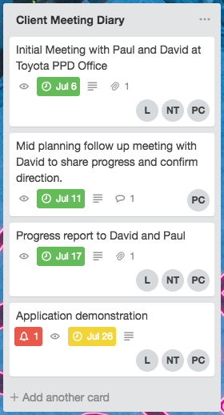\
Trello client interaction diary.

## Information Gathering
After the initial meeting with our client we were able to understand the full requirements of the project. This allowed us to carry out extensive research so we were able to move forward and start coding confidently knowing we had the tools available to complete the tasks required.\
From our research we were able to determine that we needed to provide the following:
- user authentication
- user authorization
- file upload and download
- administration rights

## Project Planning and Scope
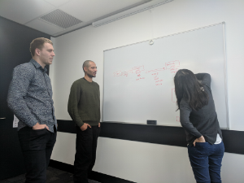 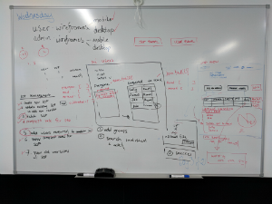\
Team white-boarding planning sessions

 Once we understood our project requirements and had a plan of attack our team put together a keynote presentation which included a preliminary statement of project scope and planning direction which we presented to our team of instructors for project sign off.

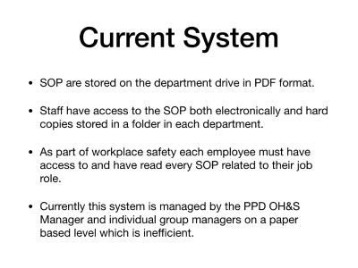
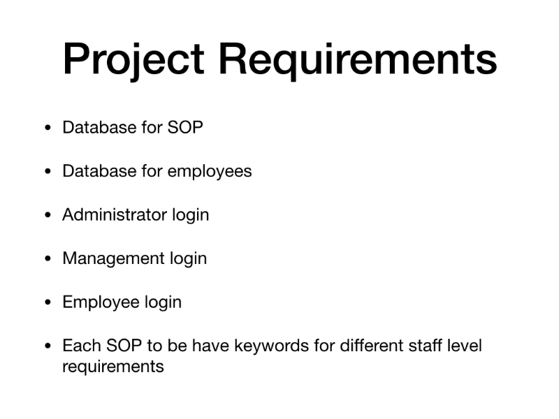\
Project presentation for sign off.

## Project Schedule
A basic project schedule was created to provide a broad overview and understanding of the overall project timeline week to week. Our team trello board was used for more focused project control and individual task detail.

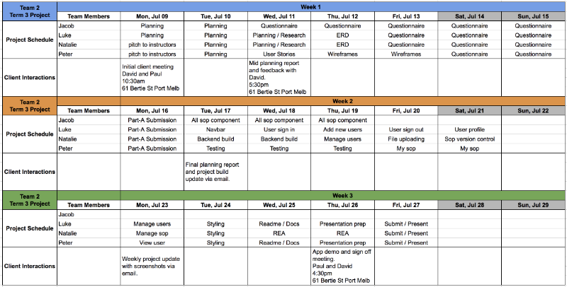

## Work Allocation
Project roles and responsibilities were allocated amongst the team after a group discussion via our group Trello board. Using a group trello board allowed us to monitor each others assigned work progress, flag any issues and reassess the project scope as the project build progressed.
Our group trello board included the following lists:
- Components backlog
- Misc backlog
- In progress
- For review
- Completed
- Issues

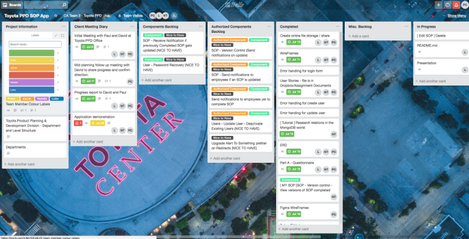\
Group Tracking Trello Board.

Our group trello board can be visited using the following link -
[Group 2 - Trello Board](https://trello.com/b/JF1Avb8y/toyota-ppd-sop-app).

## Git, GitHub and Git Workflow
To prevent any workflow issues we decided as a group from the start to have a protected master and work off a frontend and backend development branch. 
Pull requests were made to the master branch at intermittent times through out the project.

One team member was made Git master and other team members forked the development branches and worked on feature branches from there.

Further insights in to our merges, commits, pull requests and overall project flow can be found at our GitHub links at the top of this document. [Top](#CA-Team-2---Term-3-Group-Project)

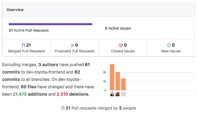 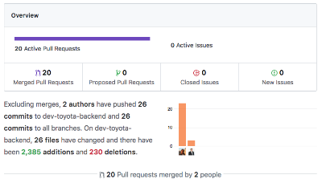\
Front and Backend GitHub insights

## Code Reviews
- Code reviews - (Luke)

## Final Project Sign Off
**After Thursday final meeting**
- Manage system testing and hand over activities. Prepare maintenance or support plans for client
- Obtain final project sign-off
- As a team, conduct post project review
- Create a questionnaire for the client to ascertain the satisfaction with your products and services

 

# Application Design
## Database Design
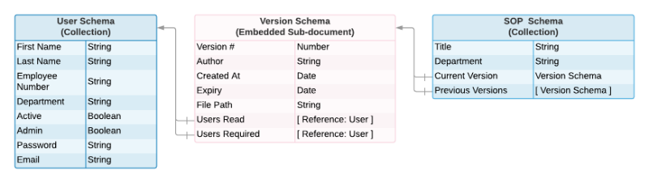\
Our database schema design.

## User Stories
Our User Stories
__OH&S Coordinator__
- [ SOP - Upload ] As the OH&S Coordinator I would like to add SOP's to a central database so that staff can have immediate access to new SOP's.
- [ SOP - Update ] [ SOP - Version Control ] As the OH&S Coordinator I would like to easily add updated SOP's to the database so that updates are made available to staff as soon as they are implemented.
- [ Users - Add New Users ] As the OH&S Coordinator I would like to add new users to the database so that there are no delays in adding new staff or staff changes to the SOP system.
- [ User - Update Existing User ] As the OH&S Coordinator I would like to be able to edit user accounts so that any staff changes are implemented as soon as they occur.
- [ User - Deactivate Existing User ] As the OH&S Coordinator I would like to be able to delete user accounts so that staff changes are implemented as soon as they occur.
- [ SOP - Version Control ] As the OH&S Coordinator I would like to keep copies of older versions of SOP's available on the database so that there is a traceable history of changes and progress for workplace safety audits.
- [ SOP - View All ] As the OH&S Coordinator I would like to access all SOP's so that I can view which ones have and have not been read.
- [ User - View individual Users Incomplete SOP ] [ User - View individual Users complete SOP ] As the OH&S Coordinator I would like to view all user profiles so that I can view which SOP's the user has or has not read.

__Department / Group Manager__
- [ User - View Staff Profile ] As a manager I would like to view my staff profiles so that I can confirm they have read their required SOP's and take action if required.
- [ SOP - Allocate users required to read SOP ] As a manager I would like to choose which SOP's my staff are required to read as each position may have individual requirements.
- [ SOP - Send notifications to employees yet to complete SOP ] As a manager I would like to be able to prompt my staff via the app if they have not met there SOP read requirements so that they can be reminded to do so. - (nice to have)
- [ SOP - Send notifications to employees if an SOP is updated ] As a manager I would like to be able to notify my staff via the app if they have not read an updated SOP so that they are up to date with the latest safety information. - (nice to have)
- [ SOP - View All ] [ SOP - Search All ] As a manager I would like to access the SOP and user database in an easy to use straight forward interface so that I don't have to learn how to use another system.

__Staff Member - Engineer__
- [ SOP - View All ] As an engineer I would like to have access to all the SOP's including those that my position requires of me so that I can do my job safely.
- [ Mobile Responsive Site ] As an engineer I would like to be able to have access to SOP's when I am working away from my desk, in the workshop or remotely so that I can have the appropriate safety information with me at all times.
- [ SOP - Versioning + Notification on Version Update ] As an engineer I would like to be notified if there has been a change to an SOP that I am required to be familiar with so that I am up to date with the latest information. - (nice to have)
- [ SOP - Search all ] As a engineer I would like to access the SOP and user database in an easy to use straight forward interface so that I don't have to learn how to use another system.
- [ SOP - View Unread ] As an engineer I would like to know which SOP's I have or have not read so I can keep track of my safety requirements.

__Staff Member - Technician__
- [ SOP - View All ] As an technician I would like to have access to all the SOP's that my position requires of me so that I can do my job safely.
- [ Mobile Responsive Site ] As an technician I would like to be able to have access to SOP's when I am working away from my desk, in the workshop or remotely so that I can have the appropriate safety information with me at all times.
- [ SOP - Versioning + Notification on Version Update ] As an technician I would like to know which SOP's I have or have not read so I can keep track of my safety requirements.
- [ SOP - Search all ] As an technician I would like to be notified if there has been a change to an SOP that I am required to be familiar with so that I am up to date with the latest information. - (nice to have)
- [ SOP - View Unread ] As a technician I would like to access the SOP and user database in an easy to use straight forward interface so that I don't have to learn how to use another system.

__Staff Member - Administration__
- [ SOP - View All ] As an administrator I would like to have access to all the SOP's that my position requires of me so that I can do my job safely.
- [ Mobile Responsive Site ] As an administrator I would like to be able to have access to SOP's when I am working away from my desk, in another part of the office so that I can have the appropriate safety information with me at all times.
- [ SOP - Versioning + Notification on Version Update ] As an administrator I would like to know which SOP's I have or have not read so I can keep track of my safety requirements.
- [ SOP - Search all ] As an administrator I would like to be notified if there has been a change to an SOP that I am required to be familiar with so that I am up to date with the latest information. - (nice to have)
- [ SOP - View Unread ] As a administrator I would like to access the SOP and user database in an easy to use straight forward interface so that I don't have to learn how to use another system.

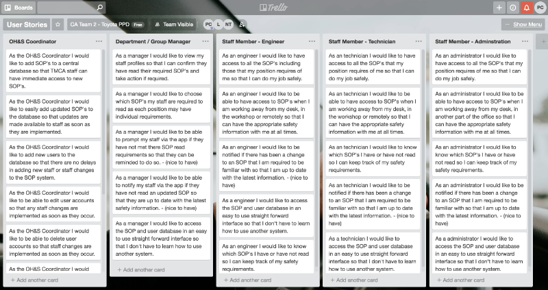\
Our User Stories Trello Board. Our Trello user stories board can be viewed here, [User Stories Trello Board](https://trello.com/b/PXeF8pny/user-stories).

## User Workflow
- A workflow diagram of the user journey/s - (Luke)

## Wireframes
- Wireframes for all main pages of your app - (Luke/Pete)

## Challenges

## Improvements

## Final review

